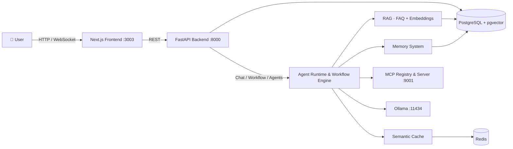

<div align="center">

# 🤖 Agent Low-Code Platform

**A low-code multi-agent platform for building intelligent customer-service bots.**

Design multi-agent workflows on a visual canvas, plug in RAG knowledge bases, semantic caching,
long-term memory and MCP tools — no code required.


</div>

---

## ✨ Features

- 🎨 **Visual workflow builder** — drag & drop agents onto a React Flow canvas, connect them,
  save and run the whole pipeline with one click.
- 🤖 **Multi-agent runtime** — FAQ agent (RAG), intent **Router**, **Supervisor** and
  **Human handoff** agents ship out of the box; define new agents directly from the database.
- 📚 **RAG knowledge base** — FAQ management with Ollama embeddings + `pgvector` + reranker.
- ⚡ **Semantic cache** — Redis-backed caching middleware with a policy engine (TTL, confidence
  scorers, cacheable intents) that turns repeat questions into instant answers.
- 🧠 **Long-term memory** — per-user session context, summarization, compression and
  experience memory that makes agents smarter over time.
- 🔌 **MCP support** — built-in Model Context Protocol server + registry; import and manage
  external MCP servers from the dashboard.
- 💬 **Real-time chat** — WebSocket streaming conversations in the dashboard.
- 🏢 **Multi-tenant** — `X-Tenant-ID` based isolation, ready for SaaS.

## 🧱 Tech Stack

| Layer      | Technology                                                              |
| ---------- | ----------------------------------------------------------------------- |
| Frontend   | Next.js 14 · React 18 · TypeScript · React Flow · TanStack Query        |
| Backend    | FastAPI · Python 3.11 · uvicorn                                         |
| Database   | PostgreSQL 16 + `pgvector` (embeddings) · SQLAlchemy                    |
| Cache      | Redis 7 (redis-stack)                                                   |
| LLM        | Ollama (local models, `:11434`)                                         |
| Protocol   | Model Context Protocol (MCP) · WebSocket                                |
| Infra      | Docker Compose                                                          |

## 🚀 Quick Start

> **Prerequisite:** a running [Ollama](https://ollama.com/) instance with your preferred
> chat & embedding models pulled.

```bash
# 1. Start the whole stack (DB + Redis + Backend + Frontend)
docker compose up --build

# 2. Open the dashboard
open http://localhost:3003
```

| Service    | URL                    |
| ---------- | ---------------------- |
| Frontend   | http://localhost:3003  |
| Backend API| http://localhost:8000  |
| MCP Server | http://localhost:9001  |
| RedisInsight | http://localhost:5540 |

## 🏗️ Architecture



## 📁 Project Structure

```
agent-low-code-platform/
├── backend/
│   ├── agents/          # Agent implementations (faq, supervisor, router, human_handoff) + config service
│   ├── api/             # REST & WebSocket endpoints
│   ├── core/            # Infrastructure: db connection & schema, JWT auth, RAG embeddings & reranker
│   ├── engine/          # Workflow engine (builder, handlers, state, middlewares)
│   ├── tool_system/     # Tool infra: adapters (MCP client) · registry · runtime(reserved)
│   ├── tool_packages/   # Tool implementations: paper MCP server · builtin MCP server
│   ├── services/        # Business domains: faq · chat · memory · cache
│   └── integrations/    # 3rd-party channel integrations (xianyu)
├── docs/                # design docs
├── frontend/
│   └── app/
│       ├── dashboard/   # agents · chat · knowledge · mcp · memory · workflow
│       └── agents/      # per-agent configuration pages
└── docker-compose.yml   # db · redis · backend · frontend
```

## 📡 API Overview

| Method | Endpoint                          | Description                    |
| ------ | --------------------------------- | ------------------------------ |
| POST   | `/api/auth/login`                 | JWT login                      |
| GET    | `/api/agents`                     | List agents                    |
| POST   | `/api/agents`                     | Create agent (DB-defined)      |
| POST   | `/api/agents/{key}/chat`          | Chat with an agent             |
| POST   | `/api/agents/{key}/route-test`    | Test router intents            |
| GET    | `/api/workflows`                  | List workflows                 |
| POST   | `/api/workflows`                  | Create workflow                |
| POST   | `/api/workflows/{id}/run`         | Run a workflow                 |
| GET    | `/api/faqs` · POST `/api/faqs`    | Knowledge-base CRUD            |
| GET    | `/api/conversations`              | Chat conversations & messages  |
| GET    | `/api/mcp/servers` · POST `…/import` | Manage MCP servers          |
| GET    | `/api/memory/users`               | Long-term memory profiles      |
| WS     | `/api/ws/chat`                    | Real-time chat                 |

Full interactive docs at `http://localhost:8000/docs` (Swagger UI).

## ⚙️ Configuration

Environment variables (see `docker-compose.yml`):

| Variable             | Default                          | Description                  |
| -------------------- | -------------------------------- | ---------------------------- |
| `DATABASE_URL`       | `postgresql://saas:saas@db:5432/saas` | PostgreSQL connection   |
| `JWT_SECRET`         | `dev-secret`                     | Token signing secret         |
| `OLLAMA_HOST`        | `http://host.docker.internal:11434` | Local LLM endpoint       |
| `NEXT_PUBLIC_API_URL`| `http://localhost:8000`          | Frontend → backend base URL  |

### 📄 Paper MCP — LLM 配置

论文域 MCP（`backend/tool_packages/paper/`，端口 `:9002`，提供 `search_papers` /
`fetch_paper_text` / `summarize_paper` / `list_papers` 四个工具）总结论文时在
**工具内部**调用 LLM，需要 OpenAI 兼容网关（`/v1/chat/completions`）。

配置方式（二选一，JSON 文件优先）：

**方式一：JSON 配置文件（推荐）**

```bash
# 复制模板为真实配置（模板会提交，真实配置已被 .gitignore 忽略）
cp backend/tool_packages/paper/llm.config.example.json backend/tool_packages/paper/llm.config.json

# 编辑三项（代码 bind-mount 到容器，改完即时生效，无需重启）
# llm.config.json
{
  "base_url": "https://api.openai.com/v1",
  "api_key": "sk-...",
  "model": "gpt-4o"
}
```

**方式二：环境变量**（docker-compose 注入）

```bash
# 项目根目录 .env
PAPER_LLM_BASE_URL=https://api.openai.com/v1
PAPER_LLM_API_KEY=sk-...
PAPER_LLM_MODEL=gpt-4o
# 然后
docker compose up -d backend
```

**Agent 决策层（paper_agent）**还需单独配置编排 LLM（AgentRuntime 使用，
与总结层相互独立、可指向不同模型）：`PUT /api/agents/paper_agent/config`，
或在 Dashboard 的 agent 配置页填写 `base_url` / `api_key` / `model`。
建议 `max_steps: 8`、`max_tokens: 3000`（默认已内置）。

## 🗺️ Roadmap

- [x] Visual workflow builder & runner
- [x] Multi-agent runtime (FAQ / Router / Supervisor / Human handoff)
- [x] RAG knowledge base with semantic cache
- [x] Long-term memory system
- [ ] Versioning & rollback for workflow drafts
- [ ] Streaming token-level chat UX
- [ ] Plugin marketplace for MCP servers
- [ ] Analytics dashboard (turns, cache hit-rate, handoff rate)

## 🤝 Contributing

Contributions are welcome! Please open an issue to discuss changes before opening a PR,
or pick up anything in the roadmap.

1. Fork the repo & create your branch (`git checkout -b feat/amazing`)
2. Commit your changes (`git commit -m 'feat: add amazing thing'`)
3. Push and open a Pull Request

## 📄 License

[MIT](LICENSE) © 2026

---

<div align="center">
⭐ If this project helps you, consider giving it a star!
</div>
