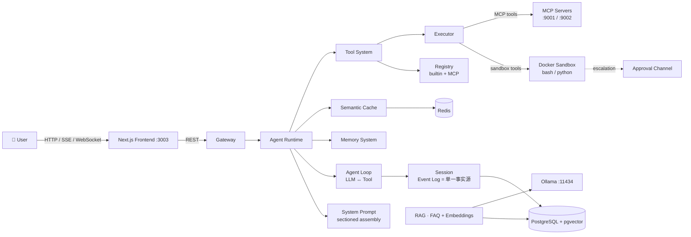

<div align="center">

# 🤖 Agent Low-Code Platform

**A low-code multi-agent platform for building intelligent customer-service bots.**

Design multi-agent workflows on a visual canvas, plug in RAG knowledge bases, semantic caching,
long-term memory and MCP tools — no code required.


</div>

---

## ✨ Features

- 🎨 **Visual workflow builder** — drag & drop agents onto a React Flow canvas, connect them,
  save and run the whole pipeline with one click.
- 🤖 **Multi-agent runtime** — FAQ agent (RAG), intent **Router** (3-level cascade),
  **Supervisor** and **Human handoff** agents ship out of the box; define new agents directly
  from the database.
- 🧩 **Sectioned system prompt** — agents' prompts are assembled per turn from registered
  contributions (identity · persona · per-tool usage guidance · runtime context), so editing a
  config takes effect immediately and tool documentation can never drift from the tool itself.
- 📚 **RAG knowledge base** — FAQ management with `pg_trgm` + Ollama embeddings (`bge-m3`) +
  `pgvector` + CrossEncoder reranker + LLM polish.
- ⚡ **Semantic cache** — Redis-backed caching middleware with a policy engine (TTL, confidence
  scorers, cacheable intents) that turns repeat questions into instant answers.
- 🧠 **Long-term memory** — per-user session context, summarization, compression and
  experience memory that makes agents smarter over time.
- 🔧 **Tool system** — a three-layer split (Registry / Runtime / Executor) with source providers
  (built-in + MCP), a concurrent scheduler (rolling pool, exclusive barriers, ordered commit)
  and per-tool declarations (timeout, execution mode, usage guidance).
- 🔒 **Sandboxed execution** — `bash` / `python` tools run in ephemeral Docker containers with
  three file-effect modes (`read-only` / `workspace-write` / `danger-full-access`); escalation
  out of a mode goes through a **human approval** channel, and everything fails closed.
- 🔌 **MCP support** — built-in Model Context Protocol server + registry; import and manage
  external MCP servers from the dashboard.
- 🗂️ **Session workspace** — each conversation gets a working folder; browse, preview (PDF /
  images / text) and upload files from the dashboard, with the same path used by the sandbox.
- 🧾 **Event-log sessions** — a session's event log is the single source of truth: chat history,
  execution trace and cold restore are all projections of it, not separate stores.
- 💬 **Real-time chat** — SSE streaming in the dashboard + WebSocket conversations.
- 🏢 **Multi-tenant** — `X-Tenant-ID` based isolation, ready for SaaS.

## 🧱 Tech Stack

| Layer      | Technology                                                                    |
| ---------- | ----------------------------------------------------------------------------- |
| Frontend   | Next.js 14 · React 18 · TypeScript · React Flow (`@xyflow/react`) · TanStack Query |
| Backend    | FastAPI · Python 3.12 · uvicorn · raw SQL over `psycopg2`                      |
| Database   | PostgreSQL 16 + `pgvector` (embeddings) + `pg_trgm` (fuzzy match)              |
| Cache      | Redis 7 (redis-stack)                                                          |
| LLM        | Any OpenAI-compatible gateway (`/v1/chat/completions`) per agent               |
| Embeddings | Ollama `bge-m3` + `BAAI/bge-reranker-v2-m3` (CrossEncoder)                     |
| Sandbox    | Ephemeral Docker containers (via mounted `docker.sock`)                        |
| Protocol   | Model Context Protocol (MCP) · SSE · WebSocket                                 |
| Infra      | Docker Compose                                                                 |

## 🚀 Quick Start

> **Prerequisite:** a running [Ollama](https://ollama.com/) instance with the `bge-m3`
> embedding model pulled (`ollama pull bge-m3`).

```bash
# 1. Start the whole stack (DB + Redis + Backend + Frontend)
docker compose up --build

# 2. Open the dashboard
open http://localhost:3003
```

| Service      | URL                    |
| ------------ | ---------------------- |
| Frontend     | http://localhost:3003  |
| Backend API  | http://localhost:8000  |
| RedisInsight | http://localhost:5540  |

MCP Server（`:9001` 通用 / `:9002` 论文域）只监听 backend 容器内网，不映射到宿主机。
要在宿主上调试：`docker compose exec backend curl localhost:9001/mcp`。

沙箱需要 backend 容器能访问宿主 Docker daemon（`/var/run/docker.sock` 已挂载），
并配置独立的工作区根目录 —— 见下方 Configuration。

## 🏗️ Architecture



**执行链路的单一事实源**：一次对话产生的所有事件（用户消息、助手消息、工具调用与结果、
运行限制、usage）都写进 `Session` 的 Event Log。对话历史、执行轨迹（trace）、冷恢复
都从它派生——不存在第二套存储。

**System Prompt 的位置**：它**不在** Event Log 里。每轮请求由 `SystemPrompt` 从已注册的
贡献现算（身份 · 角色 · 每个工具的使用指导 · 运行时上下文），渲染后作为 `messages[0]`
注入。这样改配置立即生效，且工具的 JSON schema（走 `tools` 参数）与其自然语言使用指导
（走提示词）同源产出、永不漂移。详见
[`backend/agents/runtime/system_prompt/system-prompt.md`](backend/agents/runtime/system_prompt/system-prompt.md)。

## 📁 Project Structure

```
agent-low-code-platform/
├── backend/
│   ├── agents/            # Agent implementations + runtime
│   │   ├── runtime/       #   AgentRuntime · AgentLoop
│   │   │   ├── session/   #   Event Log · Surface · 持久化 · 各类投影
│   │   │   └── system_prompt/  # 分段注册的提示词组装（见模块内 system-prompt.md）
│   │   ├── router/        #   三级级联意图路由（关键词 → 向量 → LLM FC）
│   │   ├── faqagent/      #   RAG 检索 + 润色
│   │   └── supervisor/    #   编排（遗留 LangGraph 版本）
│   ├── api/               # REST & WebSocket endpoints
│   │   └── workspace.py   #   会话工作区：文件浏览 / 预览 / 上传 / 预创建会话
│   ├── core/              # Infrastructure: db connection & schema, JWT auth, RAG embeddings & reranker
│   ├── engine/            # Workflow engine (LangGraph builder, handlers, state, middlewares)
│   ├── tool_system/
│   │   ├── registry/      #   工具元数据：Provider 抽象 · ToolDescriptor · 统一索引
│   │   ├── runtime/       #   执行：ToolScheduler（并发/屏障/有序提交）· Executor
│   │   ├── sandbox/       #   沙箱：策略解析 · Docker 后端 · 路径解析 · 升权
│   │   ├── context/       #   ToolContext（一次调用的运行时上下文）
│   │   └── events/        #   Tool 生命周期事件
│   ├── interaction/       # 通用人工审批层（沙箱升权等能力的裁决通道）
│   ├── gateway/           # 请求入口：RequestContext + 通道分发
│   ├── tool_packages/     # Tool implementations: paper MCP server · builtin MCP server
│   ├── services/          # Business domains: faq · chat · memory · cache
│   └── integrations/      # 3rd-party channel integrations (xianyu)
├── docs/                  # design docs (sandbox-design.md 等)
├── frontend/
│   └── app/
│       ├── dashboard/     # agents · chat · knowledge · mcp · memory · workflow
│       ├── agents/        # per-agent configuration pages
│       └── workspace/     # 工作区浏览器 + 工作区内对话
└── docker-compose.yml     # db · redis · backend · frontend
```

## 📡 API Overview

| Method | Endpoint                          | Description                    |
| ------ | --------------------------------- | ------------------------------ |
| POST   | `/api/auth/login`                 | JWT login                      |
| GET    | `/api/agents`                     | List agents                    |
| POST   | `/api/agents`                     | Create agent (DB-defined)      |
| GET    | `/api/agents/{key}/config`        | Read merged agent config       |
| PUT    | `/api/agents/{key}/config`        | Update agent config            |
| GET    | `/api/agents/{key}/prompt-preview`| Inspect the assembled system prompt + visible tools |
| POST   | `/api/agents/{key}/chat`          | Chat with an agent             |
| POST   | `/api/agents/{key}/chat/stream`   | Chat with SSE streaming        |
| POST   | `/api/agents/{key}/route-test`    | Test router intents            |
| GET    | `/api/workflows`                  | List workflows                 |
| POST   | `/api/workflows`                  | Create workflow                |
| POST   | `/api/workflows/{id}/run`         | Run a workflow                 |
| GET    | `/api/faqs` · POST `/api/faqs`    | Knowledge-base CRUD            |
| GET    | `/api/conversations`              | Chat conversations & messages  |
| GET    | `/api/mcp/servers` · POST `…/import` | Manage MCP servers          |
| GET    | `/api/tools/bindings` · PUT `…/{agent_key}` | Bind tools to an agent |
| GET    | `/api/workspace/sessions` · POST `/api/workspace/sessions` | List / pre-create workspace sessions |
| GET    | `/api/workspace/{id}/files` · `/file` | Browse & preview workspace files |
| POST   | `/api/workspace/{id}/upload`      | Upload files into a session workspace |
| GET    | `/api/memory/users`               | Long-term memory profiles      |
| GET    | `/api/approvals` · POST `…/{id}`  | Pending approvals & decisions  |
| WS     | `/api/ws/chat`                    | Real-time chat                 |

Full interactive docs at `http://localhost:8000/docs` (Swagger UI).

## ⚙️ Configuration

Environment variables (see `docker-compose.yml`):

| Variable                | Default                                | Description                          |
| ----------------------- | -------------------------------------- | ------------------------------------ |
| `DATABASE_URL`          | `postgresql://saas:saas@db:5432/saas`  | PostgreSQL connection                |
| `JWT_SECRET`            | `dev-secret`                           | Token signing secret                 |
| `OLLAMA_HOST`           | `http://host.docker.internal:11434`    | Embedding / rerank endpoint          |
| `NEXT_PUBLIC_API_URL`   | `http://localhost:8000`                | Frontend → backend base URL          |
| `SANDBOX_WORKSPACE_ROOT`| `/srv/agent/workspaces`                | Sandbox workspace root (host-visible) |
| `SANDBOX_DEFAULT_MODE`  | `workspace-write`                      | `read-only` · `workspace-write` · `danger-full-access` |
| `SANDBOX_READ_ROOTS`    | —                                      | Extra **read-only** host mounts (comma-separated) |
| `SANDBOX_WRITE_ROOTS`   | —                                      | Extra **writable** host mounts (comma-separated) |

**LLM 配置是 per-agent 的**：每个 agent 在自己的 config 里配 `base_url` / `api_key` / `model`
（任意 OpenAI 兼容网关，如 DeepSeek、OpenAI、vLLM），在 Dashboard 的 agent 配置页填写，
或 `PUT /api/agents/{key}/config`。

### 📄 Paper MCP — LLM 配置

论文域 MCP（`backend/tool_packages/paper/`，端口 `:9002`，提供 `search_papers` /
`fetch_paper_text` / `summarize_paper` / `list_papers` 四个工具）总结论文时在
**工具内部**调用 LLM，需要 OpenAI 兼容网关（`/v1/chat/completions`）。

配置方式（二选一，JSON 文件优先）：

**方式一：JSON 配置文件（推荐）**

```bash
# 复制模板为真实配置（模板会提交，真实配置已被 .gitignore 忽略）
cp backend/tool_packages/paper/llm.config.example.json backend/tool_packages/paper/llm.config.json

# 编辑三项（代码 bind-mount 到容器，改完即时生效，无需重启）
# llm.config.json
{
  "base_url": "https://api.openai.com/v1",
  "api_key": "sk-...",
  "model": "gpt-4o"
}
```

**方式二：环境变量**（docker-compose 注入）

```bash
# 项目根目录 .env
PAPER_LLM_BASE_URL=https://api.openai.com/v1
PAPER_LLM_API_KEY=sk-...
PAPER_LLM_MODEL=gpt-4o
# 然后
docker compose up -d backend
```

**Agent 决策层（paper_agent）**还需单独配置编排 LLM（AgentRuntime 使用，
与总结层相互独立、可指向不同模型）：`PUT /api/agents/paper_agent/config`，
或在 Dashboard 的 agent 配置页填写 `base_url` / `api_key` / `model`。
建议 `max_steps: 8`、`max_tokens: 3000`（默认已内置）。

## 🗺️ Roadmap

- [x] Visual workflow builder & runner
- [x] Multi-agent runtime (FAQ / Router / Supervisor / Human handoff)
- [x] RAG knowledge base with semantic cache
- [x] Long-term memory system
- [x] Tool system with MCP + sandboxed execution + human approval
- [x] Sectioned system prompt assembly
- [x] Session workspace (files, preview, upload)
- [ ] Versioning & rollback for workflow drafts
- [ ] Plugin marketplace for MCP servers
- [ ] Analytics dashboard (turns, cache hit-rate, handoff rate)
- [ ] Memory system wired into the main agent runtime

## 🤝 Contributing

Contributions are welcome! Please open an issue to discuss changes before opening a PR,
or pick up anything in the roadmap.

1. Fork the repo & create your branch (`git checkout -b feat/amazing`)
2. Commit your changes (`git commit -m 'feat: add amazing thing'`)
3. Push and open a Pull Request

### Development notes

- 后端改动后若 `--reload` 卡死，`docker compose restart backend`。
- 测试与模块同目录（`test_*.py`），自带 `main()` 运行器（容器内没有 pytest）：

  ```bash
  docker compose exec backend python backend/agents/runtime/system_prompt/test_system_prompt.py
  docker compose exec backend python backend/tool_system/sandbox/test_sandbox.py
  ```

## 📄 License

[MIT](LICENSE) © 2026

---

<div align="center">
⭐ If this project helps you, consider giving it a star!
</div>
